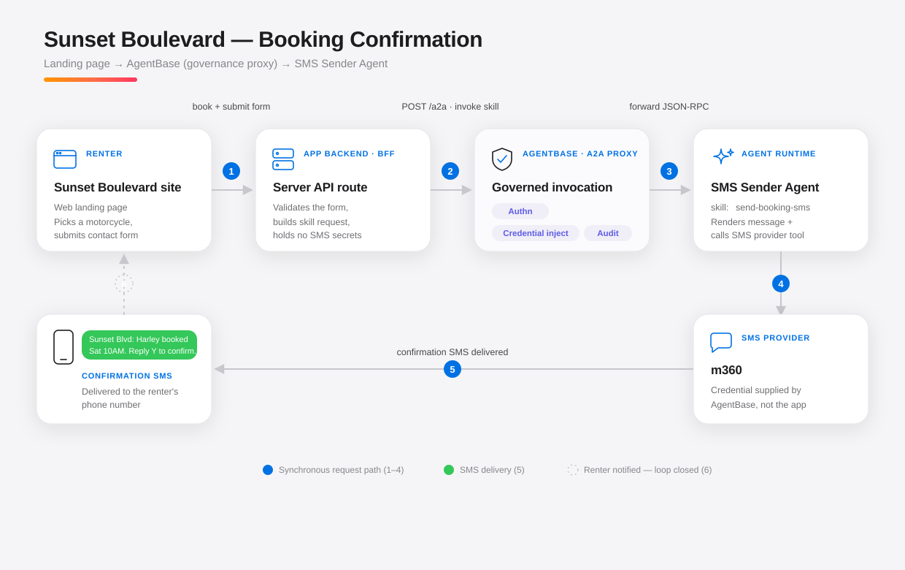

# WORKFLOW — Sunset Boulevard Booking Confirmation (Sample)

> **Sample workflow — illustrative only.** This document describes a hypothetical end-to-end flow to show how Precast (Next.js + Mastra) and AgentBase fit together. **No Precast boilerplate code is created or modified.** All code fragments below are illustrative, not shipped in the repo.

**Last Updated:** 2026-07-07
**Related:** [INTEGRATION_AGENTBASE.md](INTEGRATION_AGENTBASE.md) (registration + protocol facts, verified)

---

## 1. Scenario

**Sunset Boulevard** is a motorcycle rental. Its public site is a **Next.js** landing page. A renter browses bikes, picks one, and completes a **booking + contact-info form**. On submission, the site must send the renter a **confirmation SMS**.

The SMS is not sent by the web app directly. Instead:

- An **SMS Sender Agent** runs on **Mastra** and exposes a skill, `send-booking-sms`.
- That agent is **registered on AgentBase**, which sits **between** the Next.js app and Mastra as a governance proxy.
- The Next.js server calls **AgentBase**, which authenticates the call, injects the SMS provider credential, audits it, and forwards it to the Mastra agent.

This keeps SMS provider secrets and agent access **out of the web app** and centralizes auth, credentials, and audit in AgentBase.

---

## 2. Architecture



> If the SVG does not render in your viewer, open [assets/sunset-boulevard-architecture.svg](assets/sunset-boulevard-architecture.svg) directly.

**Why AgentBase in the middle (vs. Next → Mastra directly):** the SMS Sender is a _shared, governed capability_. Routing through AgentBase's A2A proxy means the web app never holds the SMS provider credential, every send is authenticated + audited, and the skill can be revoked/approved centrally without touching the app.

---

## 3. Components

| Component                 | Role                                                                                       | Runtime                            |
| ------------------------- | ------------------------------------------------------------------------------------------ | ---------------------------------- |
| **Sunset Boulevard site** | Landing page, bike catalog, booking + contact form                                         | Next.js (React) — `apps/web` shape |
| **Next.js API (BFF)**     | Validates the form, calls AgentBase, holds the AgentBase caller token (not SMS secrets)    | Next.js route handler              |
| **AgentBase**             | A2A invocation proxy: authn, credential injection, zero-trust, audit                       | AgentBase `apps/api`               |
| **SMS Sender Agent**      | Mastra agent; skill `send-booking-sms` renders the message and calls the SMS provider tool | Mastra — `apps/api` shape          |
| **SMS provider**          | Twilio/Vonage; delivers the text. Credential lives in AgentBase, injected at call time     | External                           |

---

## 4. Step-by-step flow

The numbers match the diagram.

1. **Book + submit form.** Renter selects a motorcycle and submits the booking + contact form. The browser POSTs to a same-origin Next.js route (e.g. `POST /api/bookings`) — never to AgentBase or Mastra directly.
2. **Invoke skill via AgentBase.** The Next.js route handler validates the payload (zod), persists the booking, then calls AgentBase's A2A proxy: `POST /a2a` targeting agent slug `sms-sender` + skill `send-booking-sms`. Auth: the app's AgentBase caller token (Bearer/registry token).
3. **Governed forward.** AgentBase validates the caller, confirms the skill is `APPROVED`, **injects the SMS provider credential** per the agent's declared auth scheme, **strips the inbound caller auth** (zero-trust), writes an audit record, and forwards a JSON-RPC request to the Mastra agent's endpoint.
4. **Skill runs.** The Mastra `send-booking-sms` skill renders the message from the booking params and calls its SMS provider tool.
5. **SMS delivered.** The provider sends the confirmation text to the renter's phone.
6. **Loop closed.** The renter receives the SMS; the synchronous result (`accepted` / provider message id) propagates back up the chain so the Next.js route can mark the booking **CONFIRMED** and return success to the browser.

---

## 5. Data shapes (illustrative)

**Browser → Next.js** (`POST /api/bookings`):

```jsonc
{
  "motorcycleId": "harley-street-glide",
  "pickupAt": "2026-07-11T10:00:00-07:00",
  "renter": { "name": "Alex Rivera", "phone": "+15125550137", "email": "alex@example.com" },
}
```

**Next.js → AgentBase** (`POST /a2a`, governed invocation):

```jsonc
{
  "agent_slug": "sms-sender",
  "skillId": "send-booking-sms",
  "params": {
    "message": "Sunset Blvd: your Harley Street Glide is booked for Sat Jul 11, 10:00 AM. Reply Y to confirm.",
    "to": "+15125550137",
    "metadata": { "skillId": "send-booking-sms", "bookingId": "bk_5f3a" },
  },
}
```

- `to` = renter phone; the message is rendered server-side from the booking.
- The **SMS provider credential is NOT in this payload** — AgentBase injects it downstream.

**Mastra `send-booking-sms` skill** (conceptual): input `{ to, message }` → sends via provider tool → returns `{ status: "accepted", providerMessageId }`.

---

## 6. Prerequisites / setup checklist

To make this sample real (outside the boilerplate), you would:

- [ ] **Build the SMS Sender Agent on Mastra** — an agent with a `send-booking-sms` tool that calls Twilio/Vonage. Mastra exposes it over A2A automatically (`/api/a2a/:id` + `/api/.well-known/:id/agent-card.json`).
- [ ] **Register it on AgentBase** — `POST /agents` with the agent's card URL (see [INTEGRATION_AGENTBASE.md §4](INTEGRATION_AGENTBASE.md)). Set `declaredAuthScheme` + `credentialRef` so AgentBase injects the SMS provider credential.
- [ ] **Approve the skill** — move `send-booking-sms` from `DRAFT` → `APPROVED` so it's invocable through the proxy.
- [ ] **Give the Next.js app an AgentBase caller token** — stored server-side (environment variable), used only from the route handler.
- [ ] **Add the Next.js booking route** — `apps/web/app/api/bookings/route.ts`: validate (zod) → persist → call AgentBase → return status.

---

## 7. Error & edge handling (recommended)

| Situation                                | Behavior                                                                                                          |
| ---------------------------------------- | ----------------------------------------------------------------------------------------------------------------- |
| Invalid form                             | Next.js route rejects with 400 before any agent call.                                                             |
| Skill not `APPROVED` / agent unreachable | AgentBase returns an error; Next.js saves booking as `PENDING_SMS`, returns success to user, retries out-of-band. |
| SMS provider failure                     | Surfaced as the skill result; booking stays `PENDING_SMS`; do not block the booking on SMS.                       |
| Duplicate submits                        | Idempotency key (`bookingId`) on the Next.js route so the SMS isn't sent twice.                                   |
| Unsupported auth (`OAuth2`, `mTLS`)      | AgentBase proxy returns `501` — use `Bearer`/`ApiKey`/`Basic`/`OAuth2ClientCredentials`/`None`.                   |

---

## 8. Security notes

- **Secrets isolation:** the web app holds only its AgentBase caller token; the SMS provider credential lives in AgentBase and is injected at call time.
- **Zero-trust:** AgentBase strips the inbound caller `Authorization` before forwarding upstream — the Mastra agent never sees the caller's token.
- **Auditability:** every invocation is recorded (agent, skill, status, latency, trace id) in AgentBase.
- **Least privilege:** the app can invoke only `APPROVED` skills it's authorized for; revocation is central.

---

## 9. Boundaries of this sample

- This is a **design document**, not an implementation. The names `sms-sender`, `send-booking-sms`, motorcycle ids, and phone numbers are placeholders.
- The Precast repo ships a neutral `example-agent` and an unwired Next.js app; wiring this workflow would be net-new project code, intentionally **not** added here.
- Protocol/registration claims are verified in [INTEGRATION_AGENTBASE.md](INTEGRATION_AGENTBASE.md); this doc reuses them without re-verifying.
